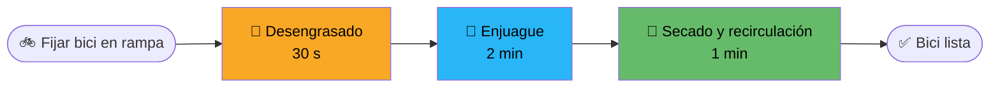

<div align="center">

# 🚲💦 BiciClean

### Estación Autónoma de Autolavado y Mantenimiento Ecológico para Bicicletas


**Lava, desengrasa y seca tu bici en menos de 4 minutos, con 8 litros de agua y cero esfuerzo.**

[🧮 Simulador de ahorro](https://TU-USUARIO.github.io/biciclean/) ·
[🔧 Documentación técnica](docs/TECNICO.md) ·
[📸 Evidencias](evidencias/)

</div>

---

## 🧭 Navegación rápida

| Soy... | Quiero... | Ir a |
|---|---|---|
| 🚴 Ciclista / repartidor | Entender qué es y cuánto ahorro | [Resumen](#-qué-es-biciclean) |
| 🏟️ Administrador de ciclovía o centro deportivo | Ver si me conviene instalarla | [Comparativa](#-comparativa) |
| 🛠️ Ingeniero / estudiante | Ver diseño, control y métricas | [docs/TECNICO.md](docs/TECNICO.md) |
| 🎬 Curioso | Ver el prototipo funcionando | [Evidencias](#-evidencias) |

---

## 🌟 ¿Qué es BiciClean?

Una **cabina compacta de autoservicio**: metes la bici en la rampa, se fija en segundos y la estación hace todo sola:

- 🧼 **Desengrasa** la transmisión con un producto biodegradable.
- 🚿 **Enjuaga** con chorros suaves en abanico y cepillos integrados.
- 💨 **Seca** mientras el agua se filtra y se recircula.

### 😩 El problema

- 🏢 Lavar la bici en un departamento es incómodo y ensucia todo.
- 💧 Una manguera común gasta **30–40 L** por lavado.
- ⚙️ Sin mantenimiento, la **transmisión se desgasta** antes de tiempo.

### ✅ Nuestra solución

- 💧 **8 L por lavado** (≈ 1 balde pequeño en vez de 3–4 baldes llenos).
- ⏱️ **Menos de 4 minutos**, sin esfuerzo manual.
- 🔒 **Presión regulada**: no daña rodamientos ni sellos.
- ⚡ **Sin alta tensión**: funcionamiento seguro.
- ♻️ **Agua recirculada** gracias a una trampa de decantación.

### 👥 ¿Para quién?

🚴 Ciclistas urbanos · 🏁 Ciclistas deportivos · 🛵 Repartidores de delivery · 🏟️ Administradores de ciclovías y centros deportivos

---

## 🔍 Explora por perfil

<details>
<summary><b>🚴 Público general: Antes vs Después</b></summary>

| | ❌ Antes | ✅ Con BiciClean |
|---|---|---|
| Dónde | Balcón, baño o patio | Estación pública, lista para usar |
| Agua | 30–40 L (3–4 baldes) | 8 L (menos de un balde) |
| Tiempo | 20–30 min de fregado | < 4 min automáticos |
| Resultado | Cadena aún grasosa | Transmisión desengrasada |
| Esfuerzo | Mucho | Ninguno |

</details>

<details>
<summary><b>🛠️ Público especializado: datos duros</b></summary>

- **Consumo:** 8 L/ciclo
- **Recuperación de agua:** ~60 % por decantación
- **Ciclo:** 30 s desengrasante + 2 min enjuague + 1 min secado/recirculación
- **Control:** Arduino/PLC con relés y temporizadores
- **Zonas:** transmisión (baja presión + reposo) y cuadro/ruedas (abanico suave)

👉 Detalle completo en [`docs/TECNICO.md`](docs/TECNICO.md)

</details>

<details>
<summary><b>🏟️ Administradores: ¿por qué instalarla?</b></summary>

- Servicio de valor agregado para usuarios de ciclovías y centros deportivos.
- Menor consumo de agua y menos aguas residuales gracias a la recirculación.
- Operación autónoma con el tiempo de ciclo controlado por temporizadores.

</details>

---

## 📊 Comparativa

| Característica | 🚲 **BiciClean** | 🌱 Manguera tradicional | 🏭 Hidrolavadora industrial |
|---|:---:|:---:|:---:|
| **Agua por lavado** | **8 L** | 30–40 L | Alto (según equipo) |
| **Tiempo** | **< 4 min** | 15–30 min | 5–10 min |
| **Esfuerzo manual** | **Ninguno** | Alto | Medio |
| **Riesgo para rodamientos** | **Bajo (presión regulada)** | Bajo | ⚠️ Alto (presión excesiva) |
| **Desengrase de transmisión** | **✅ Química + tiempo de reposo** | ❌ Limitado | ⚠️ Por fuerza bruta |
| **Reutiliza agua** | **✅ ~60 %** | ❌ No | ❌ No |
| **Alta tensión** | **No** | No | Sí (según modelo) |
| **Uso en departamento** | **Estación externa** | ❌ Incómodo | ❌ No práctico |

> ⚠️ Los valores de manguera (30–40 L) provienen de nuestras mediciones. Los de la hidrolavadora son cualitativos; completa con tus propias pruebas.

---

## 🔄 Ciclo de lavado



```text
 0:00          0:30                      2:30            3:30
  |-- GRASA ----|------- ENJUAGUE -------|-- SECADO ------|
  |  30 s       |          2 min          |     1 min      |
  Transmisión   Cuadro y ruedas (abanico) Aire + recirculación
  baja presión  + cepillos                del agua filtrada
```

---

## 🏆 Logros

1. ✅ Estructura con rampa de fijación rápida y asperjado estratégico.
2. ✅ Filtrado continuo por decantación (el agua recuperada se reutiliza en el primer enjuague).
3. ✅ Ciclo completo en menos de 4 minutos sin esfuerzo manual.

## 📸 Evidencias

- 🎥 Videos y fotos del prototipo funcionando sin fugas → [`evidencias/`](evidencias/)
- 📈 Tabla comparativa: 8 L por lavado vs 30–40 L con manguera
- ⏱️ Pruebas de usuario cronometradas

## 🧠 Lección aprendida

> **La química adecuada (desengrasante + tiempo) supera a la fuerza bruta (presión excesiva).**
> Una presión alta dañaba los sellos de la maza y el pedalier; una presión baja sola no quitaba la grasa negra. La solución fue un sistema **bizona** independiente.

---

## 🗂️ Estructura del repositorio

```text
biciclean/
├── README.md
├── index.html          # Simulador (GitHub Pages)
├── LICENSE
├── docs/
│   └── TECNICO.md
└── evidencias/         # Fotos, videos y tablas de pruebas
```

## 👥 Equipo

**HE** y **FB**

## 📄 Licencia

Distribuido bajo licencia [MIT](LICENSE).
