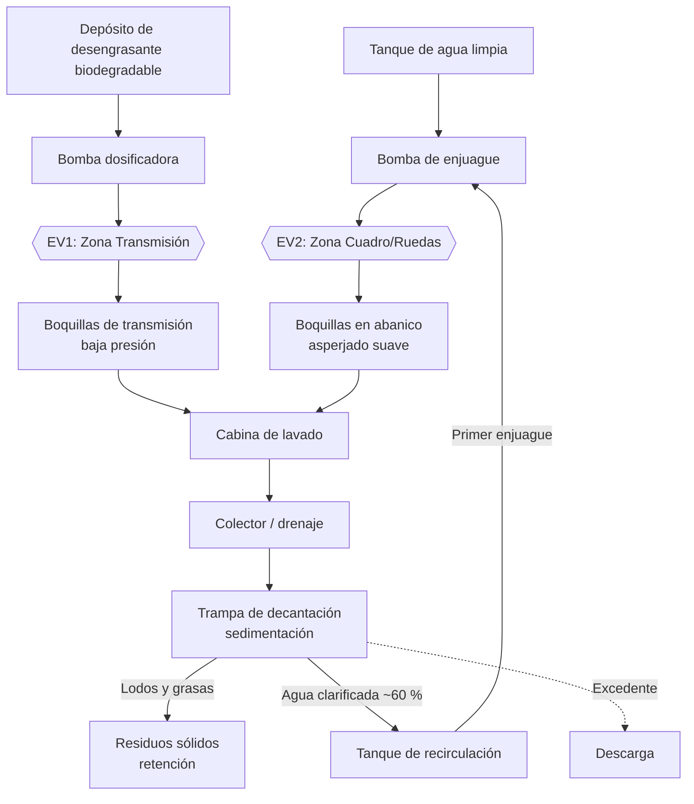
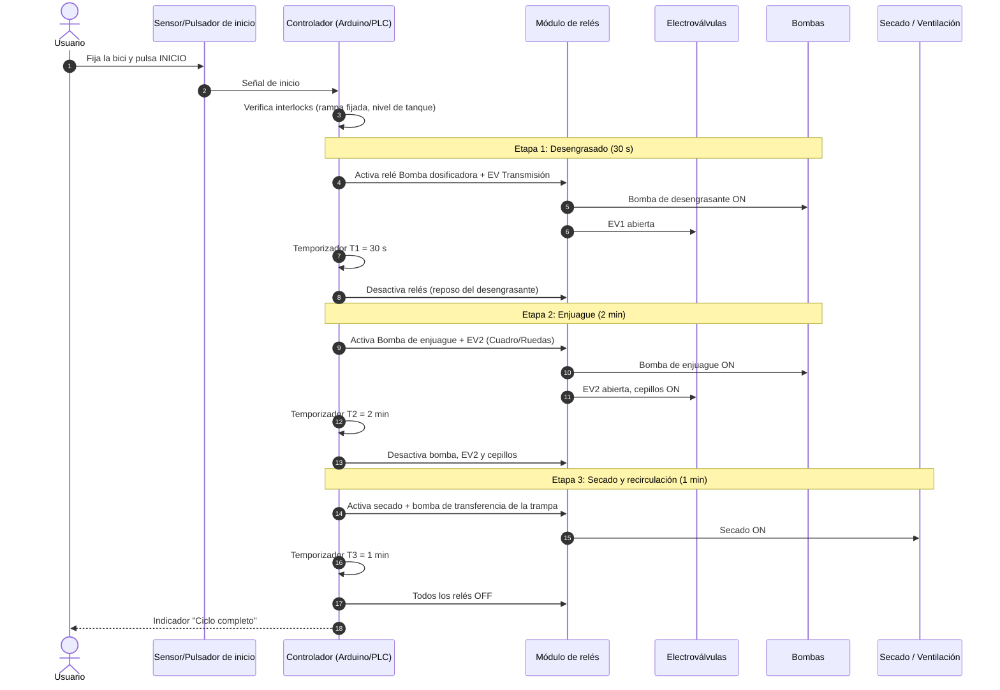

# 🔧 Documentación Técnica: BiciClean

> Volver al [README](../README.md)

## 1. Arquitectura del sistema de filtrado y recirculación

**Principio de operación:** el agua usada se recoge en un colector y pasa a una trampa de decantación. Los sólidos y la grasa sedimentan o quedan retenidos, y el agua clarificada se almacena para reutilizarse **solo en el primer enjuague**. La etapa final usa agua limpia.

---

## 2. Secuencia del control automatizado (Arduino/PLC)

**Notas de implementación**

- Lógica secuencial por temporizadores (`millis()` en Arduino o TON en PLC); evitar `delay()` bloqueante.
- Los relés conmutan cargas de bajo voltaje; el diseño **no usa alta tensión** en la zona húmeda.
- Recomendado: parada de emergencia y bloqueo si la bici no está fijada.

---

## 3. Métricas de rendimiento

| Métrica | Valor | Notas |
|---|---|---|
| Consumo de agua por ciclo | **8 L** | Medido en prototipo |
| Consumo con manguera común | 30–40 L | Referencia de comparación |
| Ahorro de agua | ~75 % | Calculado vs. valor medio de manguera |
| Tasa de recuperación de agua | **~60 %** | Por decantación |
| Tiempo de ciclo | **< 4 min** | 30 s + 2 min + 1 min = 3 min 30 s |
| Presión Zona Transmisión | `[__]` PSI / `[__]` bar | **Completar con medición** |
| Presión Zona Cuadro/Ruedas | `[__]` PSI / `[__]` bar | **Completar con medición** |
| Caudal por zona | `[__]` L/min | **Completar con medición** |
| Fugas observadas | 0 | Según pruebas del prototipo |

### Desglose del ciclo

| Etapa | Duración | Zona | Fluido | Presión |
|---|---|---|---|---|
| 1. Desengrasado | 30 s | Transmisión | Desengrasante biodegradable | Baja |
| 2. Enjuague | 2 min | Cuadro y ruedas | Agua (reciclada en el primer enjuague) | Baja, en abanico |
| 3. Secado/recirculación | 1 min | Toda la bici | Aire / transferencia de agua | n/a |

---

## 4. Diseño bizona y protección de rodamientos

### El reto de ingeniería

| Escenario | Resultado |
|---|---|
| Presión alta | ❌ Dañaba los sellos de la maza y el pedalier |
| Presión baja | ❌ No eliminaba la grasa negra de la transmisión |

### La solución: dos circuitos hidráulicos independientes

**Zona A: Transmisión** (cadena, cassette, platos)
- Desengrasante biodegradable aplicado a **baja presión**.
- **Tiempo de reposo** para que la química disuelva la grasa.
- Enjuague posterior en la zona B.

**Zona B: Cuadro y ruedas**
- Asperjado suave en **abanico** (patrón amplio, baja energía de impacto).
- Cepillos integrados para retirar el barro sin presión excesiva.

### Mitigación de penetración de agua en rodamientos

1. **Presión regulada:** la baja presión evita vencer los labios de los sellos de maza, pedalier y dirección.
2. **Patrón en abanico:** distribuye el flujo y reduce la fuerza puntual sobre juntas y sellos.
3. **Separación de zonas:** cada zona tiene su propia electroválvula y regulación; no se aplica presión de limpieza intensiva donde no se necesita.
4. **Geometría de asperjado:** boquillas orientadas a evitar el impacto directo contra ejes y sellos.
5. **Química + tiempo en lugar de fuerza:** el desengrasante hace el trabajo que antes hacía la presión.

> **Aprendizaje clave:** la química adecuada (desengrasante + tiempo) supera a la fuerza bruta.

---

## 5. Trabajo futuro

- [ ] Registrar y publicar PSI/bar y caudales por zona.
- [ ] Medición de turbidez del agua recirculada.
- [ ] Telemetría de consumo por ciclo.
- [ ] Modo de pago / control de acceso para instalaciones públicas.
